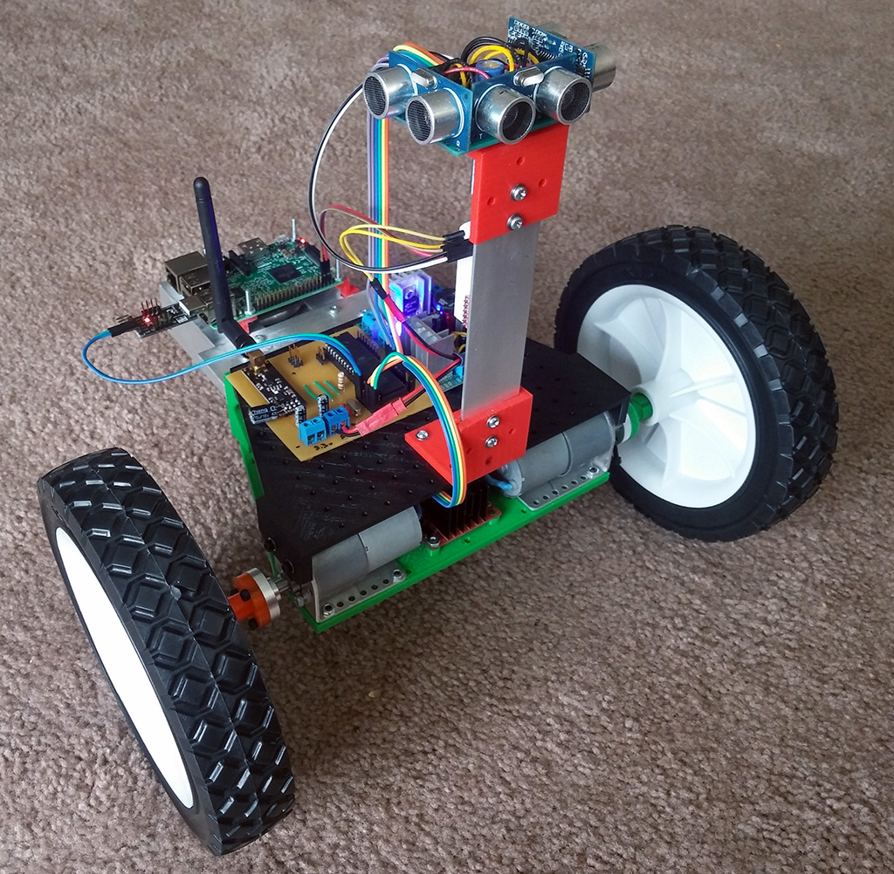

#MercatorBot
---

MercatorBot is my exploration and environment-mapping robot. Ultimately, it will be able to perform the following tasks autonomously:
- Explore and map indoors and out
- Orient itself using relative and absolute positioning techniques
- Path of least resistance analysis and pathfinding

These are all stretch goals at the moment. More details will be hammered out as I find and build the hardware and software components required to make this work.

---

## Software
- Node.js
- Express
- Socket.IO
- Arduino / INO

## Hardware
- Raspberry Pi 3
- Multiple Atmel AVR microcontrollers
- 3D-Printed and hand-made chassis components
- Various sensors, batteries, and other electronics

